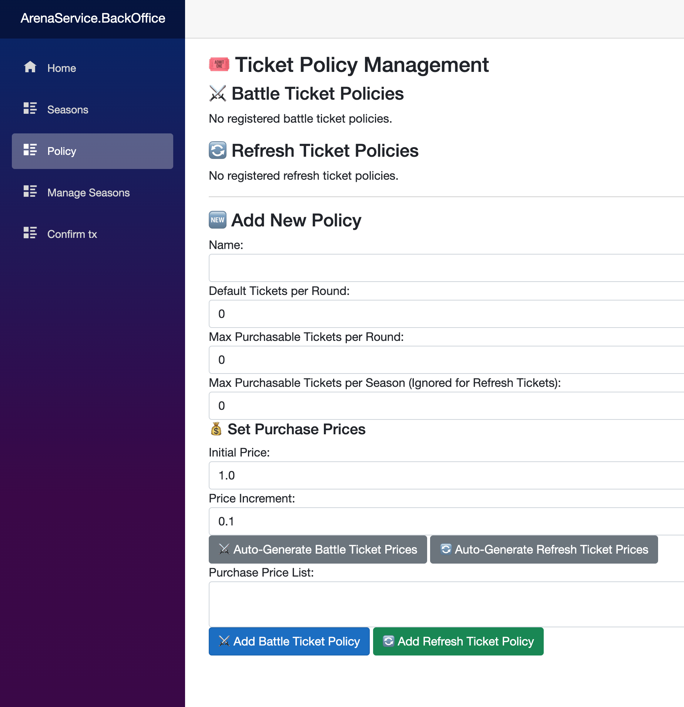

# Contributor Guide

ArenaService is an **ASP.NET-based backend application** that interacts with the **NineChronicles Chain (Headless)**.  
It leverages **Hangfire** for asynchronous task execution and **PostgreSQL** as its primary database.

## Project Structure

ArenaService is structured as follows:

- **ArenaService** → The main application handling Arena operations.
- **ArenaService.BackOffice** → A management interface for DB and Arena administration.
- **ArenaService.Shared** → A shared library containing database models and repositories, used by both `ArenaService` and `ArenaService.BackOffice`.
- **ArenaService.Tests** → Unit tests.
- **ArenaService.IntegrationTests** → Integration tests.

## Running Locally

### Prerequisites

To run ArenaService locally, **Redis** and **PostgreSQL** are required.  
For convenience, a `docker-compose.yml` file is provided with local **PostgreSQL** and **Redis** configurations.

First, install [Docker](https://www.docker.com/) if you haven't already.

### Start Dependencies

Run the following command to start PostgreSQL and Redis:

```sh
docker compose up -d
```

Expected output:
```
[+] Running 2/2
 ✔ Container arena_postgres  Running
 ✔ Container arena_redis     Running
```

### Configuration

Create a **local configuration file** for ArenaService.  
Navigate to the `ArenaService` directory and create a file named **`appsettings.Local.json`**.

Example:

```json
{
  "ConnectionStrings": {
    "DefaultConnection": "Host=localhost;Port=5432;Database=heimdall_arena;Username=local_test;Password=password"
  },
  "Redis": {
    "Host": "127.0.0.1",
    "Port": 6379
  },
  "Logging": {
    "LogLevel": {
      "Default": "Debug",
      "Microsoft.AspNetCore": "Debug"
    }
  },
  "AllowedHosts": "*",
  "Headless": {
    "HeadlessEndpoint": "https://odin-rpc.nine-chronicles.com/graphql"
  },
  "OpsConfig": {
    "RecipientAddress": "{NineChronicles Agent Address}",
    "ArenaProviderName": "PLANETARIUM",
    "JwtSecretKey": "LS0tLS1CRUdJTiBQUklWQVRFIEtFWS0tLS0tCk1JSUV2d0lCQURBTkJna3Foa2lHOXcwQkFRRUZBQVNDQktrd2dnU2xBZ0VBQW9JQkFRQ3plSmdod2lEeit4OUkKNERyTGdQY3RTSGRPQTVvUmRaT0FZNU9remhiZDJ3Y0RlY0VHWXg5ZTE0NlR0eStNamhFaUE0QkFNV05qZEFqegpIaUd0TGp4NVJVcCtvRndnRWk4TlREd2x5dmkrNjQrcFNHbUIwZU9PdmxDeDNvLzVRQ2lHV3RqdzJhYjFoR1BuClhWdzh2RGErSzNaOVlzY1h2M0pUdDV6SU9VelVFWUptSWlXbHF3VE1DRHNEbW9aamNNNmt1UXFtdUd3dFYxR0wKZnJ3Y2libXVEblBwa0E2clM3MktXcWx2ejYrb3hHZUcrSWpPTmp2b3VXQTMrV2pDUEh0ZFhUTmQyRGxyaEZucQphRjVzc0JEQWNMQzNUM2NhNzB1Z09zMFl4UFFUL2k1UXQ5dzhmQXB1R3dMWEtVbk5Yc2lDM2tpZXUxL0FyL3o1CmRwMkp4Qlp0QWdNQkFBRUNnZ0VBQWxPUXdpUWdMcFlLT2htQkppMkkrUUhEYjVQckJJa2ltdUpZdERkaFF5VlMKaEk4eHpYYzIrT3lDd2p6dmFlUlcxN3IrOVg4MVFVcUh6blJvYmYyRkg0VGloN2ZreXZkOThwUVM4V0lMU1ErMgpKZXZMb09hMjNXWkxGdjRHMUsyZzZOcGdIOEcxWVFZRElvU3ZNTXczWEhLbFNKa3FscGdjblN6WUxaMk0waFZWCnZ5UmcxbVZmWUlURmhxSU5MeG95ZXJxL25NWkE0YzVlUmIxR1NXZVVPQWpoRHNGd1NHaDZUaCtuT1oxdGhwVlYKT040SE50cGtNK3RXcVRsbitkRmF4NmFXNVprelJvUU1ITWhOUmRidlRYWmw0eTkzUUU3ZWJpWCtQM2lkUVFxMQowM0VxNTFzRTJLRTJxZElPQkx5ZnA3SFR4dWt1MXRqYy9DWHNZZDUxU1FLQmdRRGVCekJsOGoycXFlRkg5bUNFCjlGcU91a2M1Rnp5YTAwNHdJVDQrbWF2amhvcHZraFlidHZVVG5WVjNzOVJ1TEpJdDF3aVBXQy9MdlZWWG9NR0MKbUxhQmd3NGl0Y3JTQkp0Wm5FbjRQSmhMUDJlRkEvVGpTWFgvVTN6SkFoUjgxWTZPSm5xTnZoYURsdE5BcXRrNgoxSndSZyt1S3d1OVlHMWxHdjVYSjRJZjVKUUtCZ1FETzduUGhhVmR4c1R2TnlobmUvZHlNN2pmUXBrazkvOTY1CnN5UUp1SUN2V0E1T0FDR3l4WjNnbnZtSDFrZjlwZExvMWRIM2FMRDFkbHZCTi9FcDNUbyswTEhOOHh4ZWVzYlkKcitML0x2Y0FPSjhKUjQrY2E3bHBjRVVQQzJYMHQxYWZORTNYT3lVL2ZHV3ZsbG54a1ZOVG1PclVSNS9rNVg3aQpRdkl5MUR3WnFRS0JnUURKbk8rVzgxU0ovNzhoTUpuT3dYRG1BRU1pbFhZa0JWTVBvM0E1T2lQNjlMWUt3RFl4CkxuNzNNN3hqZVRtaVhmalRoVnN4aDF2SGY0TGFrcENGdlpTa29GUWFzc2VjMURBWlBERnpKOXNISVdrb1FVS0QKamJhSGh0RmVXZlF1czJIQ3RUQStPK21IemxMQWV5UE5KemtkTXBTVnFaUGJodUlYdTJzU0tVQnZ2UUtCZ1FDUgpnbE94K2VVbmFUMW9ZK2oxU1FYQmcvRnpvcnAyQW1xWG9rU0JJV0E3N0d1Q3BjME1iTEdydFo0NXlwQXM2R0g2Cm9BQlpQU0RTT2p3akRqZGkvTkZzUWt3RlNpSjB2VmorSGhBODZNVi9QbEYyc1A5bk9zalNQOFFQNUMvNWVNSk0KaVBjRGxlK0hTTzRvSGsxNDlIdm5tT3ZvQWNXSnEyY2hxM21zREZtR29RS0JnUURkWDROcTNiNkJEaFhVUDQ0bAp2Tk8wYURYOXhQaG8xdHFnZjlqZ1g5dEJMTERuQ2tWeHRpWjErSHRqMGlGVXVJTWp0RkxiRjltWkgxRlZQdlFZCk8xeEcwdk42RE5LbGlkMU9RQzJLOUhiMDJ4OFRNbVZ3dXA5ZTh5Sy9ZeVc5N3IvMi9oVkxEWGNSQnF5c09YY1oKZjBDbVhucWpHcGdPa1ZqWE5IRm1uSkYrT2c9PQotLS0tLUVORCBQUklWQVRFIEtFWS0tLS0tCg==",
    "JwtPublicKey": "LS0tLS1CRUdJTiBQVUJMSUMgS0VZLS0tLS0KTUlJQklqQU5CZ2txaGtpRzl3MEJBUUVGQUFPQ0FROEFNSUlCQ2dLQ0FRRUFzM2lZSWNJZzgvc2ZTT0E2eTREMwpMVWgzVGdPYUVYV1RnR09UcE00VzNkc0hBM25CQm1NZlh0ZU9rN2N2akk0UklnT0FRREZqWTNRSTh4NGhyUzQ4CmVVVktmcUJjSUJJdkRVdzhKY3I0dnV1UHFVaHBnZEhqanI1UXNkNlArVUFvaGxyWThObW05WVJqNTExY1BMdzIKdml0MmZXTEhGNzl5VTdlY3lEbE0xQkdDWmlJbHBhc0V6QWc3QTVxR1kzRE9wTGtLcHJoc0xWZFJpMzY4SEltNQpyZzV6NlpBT3EwdTlpbHFwYjgrdnFNUm5odmlJempZNzZMbGdOL2xvd2p4N1hWMHpYZGc1YTRSWjZtaGViTEFRCndIQ3d0MDkzR3U5TG9Eck5HTVQwRS80dVVMZmNQSHdLYmhzQzF5bEp6VjdJZ3Q1SW5ydGZ3Sy84K1hhZGljUVcKYlFJREFRQUIKLS0tLS1FTkQgUFVCTElDIEtFWS0tLS0tCg==",
    "HangfireUsername": "admin",
    "HangfirePassword": "testtest"
  }
}
```

### Configuration Details:

- **`HeadlessEndpoint`** → Specify the blockchain node to connect to.
- **`RecipientAddress`** → Address for receiving NCG rewards.
- **`ArenaProviderName`** → Name of the provider recorded on-chain. If you want to become a new Arena operator, add your provider name to the [ArenaProvider Enum](https://github.com/planetarium/lib9c/blob/development/Lib9c/Action/Arena/ArenaProvider.cs).
  - If you're testing, you can use `"PLANETARIUM"`.
- **`JwtSecretKey` & `JwtPublicKey`** → Used for **Battle Token verification**.
  - Generate a private key:
    ```sh
    openssl genpkey -algorithm RSA -out private.pem -pkeyopt rsa_keygen_bits:2048
    ```
  - Convert it to **Base64**:
    ```sh
    base64 -i private.pem
    ```
  - Generate a public key from it:
    ```sh
    openssl rsa -pubout -in private.pem -out public.pem
    ```
  - Convert the public key to **Base64** as well.
- **`HangfireUsername` & `HangfirePassword`** → Credentials for accessing the Hangfire management dashboard.


### Database Migration

Before running the service, **migrate the database**:

```sh
ASPNETCORE_ENVIRONMENT=Local dotnet ef database update --project ArenaService.Shared --startup-project ArenaService
```

### Run ArenaBackOffice
아까 아레나서비스의 appsettings.Local.json을 만든 것 처럼 BackOffice를 실행하기 위한 파일이 필요합니다.
다만, docker compose를 통해 실행하셨다면 이미 있는 Development 설정을 사용하셔도 됩니다.

```
ASPNETCORE_ENVIRONMENT=Development dotnet run --project ArenaService.BackOffice
```
이후 콘솔에 표시되는 로컬호스트 사이트에 접속한 후 policy 메뉴에 접속합니다.



policy는 시즌에서 사용되는 티켓의 최대 개수, 기본 지급 개수 등을 설정할 수 있습니다.
편한대로 설정해주셔도 되지만 일단 실행해보기 위해 아래처럼 입력해 배틀, 리프레시 정책을 추가해주세요
```
Name: Normal Season Battle Ticket Policy
Default Tickets Per Round: 4
Max Purchasable Tickets Per Round: 5
Max Purchasable Tickets Per Season: 20
Initial Price: 0.1
Price Increment: 0.1

> Click AutoGenerate Battle Ticket Prices! and Add Battle Ticket Policy
```

```
Name: Normal Season Refresh Ticket Policy
Default Tickets Per Round: 2
Max Purchasable Tickets Per Round: 4
Max Purchasable Tickets Per Season: 4
Initial Price: 0.1
Price Increment: 0.1

> Click AutoGenerate Refresh Ticket Prices! and Add Refresh Ticket Policy
```

이제 시즌을 추가할 차례입니다. Seasons 메뉴를 선택해주세요.
Client에서는 챔피언쉽과 챔피언쉽 사이에있는 시즌들을 보여주도록 되어있습니다. 그래서 가짜로 첫 시즌은 종료된 챔피언쉽을 넣어줘야합니다.

```
Season Start Block: 1
Round Interval: 1
Total Number of Rounds: 1
Arena Type: CHAMPIONSHIP
Battle Policy ID: 1
Refresh Policy ID: 1

> Click Add Season
```

이제 원하는 시즌들과 마지막에 챔피언쉽이 존재하도록 시즌들을 추가해줍니다.
지금 시작을 할 시즌은 시작블록을 연결할 체인의 최신 인덱스로 넣어 각 값을 넣어줍니다.

```
Season Start Block: {now tip}
Round Interval: 10000
Total Number of Rounds: 10
Arena Type: SEASON
Battle Policy ID: 1
Refresh Policy ID: 1

> Click Add Season
```

```
Season Start Block: {두번째로 넣은 시즌의 종료 블록 +1}
Round Interval: 10000
Total Number of Rounds: 10
Arena Type: CHAMPIONSHIP
Battle Policy ID: 1
Refresh Policy ID: 1

> Click Add Season
```

이제 시즌 준비도 완료입니다.

### 유저 준비
아레나에 참가시킬 유저들이 필요합니다.
제가 유저들을 스크래핑해 scripts/arena-data 에 넣어두었고 scripts/init_users.py 로 유저를 넣어줄 수 있습니다.

먼저 .env를 scripts/.env 에 만들어주세요
```
DB_CONNECTION_STRING="Host=localhost;Port=5432;Database=arena;Username=local_test;Password=password"
```

아래와 같이 python 환경을 구성한 후에 스크립트를 실행합니다.
```sh
cd scripts
python -m venv .venv
. .venv/bin/activate
pip3 install -r requirements.txt
python3 init_users.py odin
```

유저를 추가했다면 최초 시즌에는 참가 및 스냅샷을 생성 시켜줘야합니다.
참가시킬 시즌은 위에서 시작 블록인덱스를 현재 시점에 맞춰 만들어준 시즌입니다.
DB에 접속해 해당 season의 id를 알아와주세요.
DB의 username password는 시작할 때 사용한 docker-compose.yml 파일에 적혀있습니다.

```sh
python3 init_participants.py {season id}
```

해당 시즌에 유저들을 참가시켰다면 첫 라운드의 최초 점수를 등록해줘야합니다.
동일하게 DB에 접속해 rounds 테이블 중 해당 시즌에 연결된 첫번째 round id를 알아와주세요.

```sh
python3 init_snapshots.py {season id} {round id}
```

### 시즌 준비
다시 백오피스로 돌아와 Manage Seasons 메뉴에 들어갑니다.
이후 준비시킬 시즌을 적고 시작을 


## Running Tests

ArenaService includes **unit tests** and **integration tests**.  
Run the tests with:

```sh
dotnet test ArenaService.Tests
```

For integration tests:

```sh
dotnet test ArenaService.IntegrationTests
```

## Create Migration
```
dotnet ef migrations add {Name} --project ArenaService.Shared --startup-project ArenaService
```

## Need Help?

- **Join our Discord** for discussions: [Planetarium Dev Discord](https://planetarium.dev/discord)
- **Check out our Wiki**: [ArenaService Wiki](https://github.com/planetarium/ArenaService/wiki)
