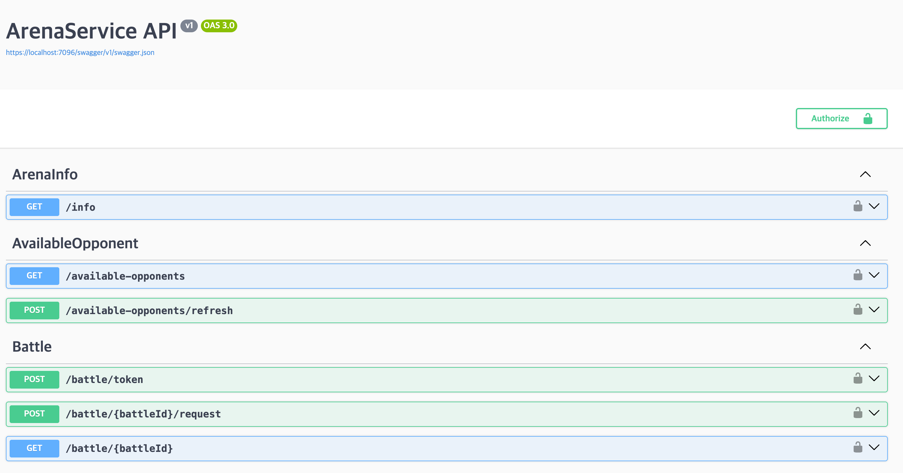

# Contributor Guide

ArenaService is an **ASP.NET-based backend application** that interacts with the **NineChronicles Chain (Headless)**.  
It leverages **Hangfire** for asynchronous task execution and **PostgreSQL** as its primary database.

## Project Structure

ArenaService is structured as follows:

- **ArenaService** → The main application handling Arena operations.
- **ArenaService.BackOffice** → A management interface for DB and Arena administration.
- **ArenaService.Shared** → A shared library containing database models and repositories, used by both `ArenaService` and `ArenaService.BackOffice`.
- **ArenaService.Tests** → Unit tests.
- **ArenaService.IntegrationTests** → Integration tests.

## Running Locally

### Prerequisites

To run ArenaService locally, **Redis** and **PostgreSQL** are required.  
For convenience, a `docker-compose.yml` file is provided with local **PostgreSQL** and **Redis** configurations.

First, install [Docker](https://www.docker.com/) if you haven't already.

### Start Dependencies

Run the following command to start PostgreSQL and Redis:

```sh
docker compose up -d
```

Expected output:
```
[+] Running 2/2
 ✔ Container arena_postgres  Running
 ✔ Container arena_redis     Running
```

### Configuration

Create a **local configuration file** for ArenaService.  
Navigate to the `ArenaService` directory and create a file named **`appsettings.Local.json`**.

Example:

```json
{
  "ConnectionStrings": {
    "DefaultConnection": "Host=localhost;Port=5432;Database=arena;Username=local_test;Password=password"
  },
  "Redis": {
    "Host": "127.0.0.1",
    "Port": 6379
  },
  "Logging": {
    "LogLevel": {
      "Default": "Debug",
      "Microsoft.AspNetCore": "Debug"
    }
  },
  "AllowedHosts": "*",
  "Headless": {
    "HeadlessEndpoint": "https://heimdall-rpc.nine-chronicles.com/graphql"
  },
  "OpsConfig": {
    "RecipientAddress": "{NineChronicles Agent Address}",
    "ArenaProviderName": "PLANETARIUM",
    "JwtSecretKey": "LS0tLS1CRUdJTiBQUklWQVRFIEtFWS0tLS0tCk1JSUV2d0lCQURBTkJna3Foa2lHOXcwQkFRRUZBQVNDQktrd2dnU2xBZ0VBQW9JQkFRQ3plSmdod2lEeit4OUkKNERyTGdQY3RTSGRPQTVvUmRaT0FZNU9remhiZDJ3Y0RlY0VHWXg5ZTE0NlR0eStNamhFaUE0QkFNV05qZEFqegpIaUd0TGp4NVJVcCtvRndnRWk4TlREd2x5dmkrNjQrcFNHbUIwZU9PdmxDeDNvLzVRQ2lHV3RqdzJhYjFoR1BuClhWdzh2RGErSzNaOVlzY1h2M0pUdDV6SU9VelVFWUptSWlXbHF3VE1DRHNEbW9aamNNNmt1UXFtdUd3dFYxR0wKZnJ3Y2libXVEblBwa0E2clM3MktXcWx2ejYrb3hHZUcrSWpPTmp2b3VXQTMrV2pDUEh0ZFhUTmQyRGxyaEZucQphRjVzc0JEQWNMQzNUM2NhNzB1Z09zMFl4UFFUL2k1UXQ5dzhmQXB1R3dMWEtVbk5Yc2lDM2tpZXUxL0FyL3o1CmRwMkp4Qlp0QWdNQkFBRUNnZ0VBQWxPUXdpUWdMcFlLT2htQkppMkkrUUhEYjVQckJJa2ltdUpZdERkaFF5VlMKaEk4eHpYYzIrT3lDd2p6dmFlUlcxN3IrOVg4MVFVcUh6blJvYmYyRkg0VGloN2ZreXZkOThwUVM4V0lMU1ErMgpKZXZMb09hMjNXWkxGdjRHMUsyZzZOcGdIOEcxWVFZRElvU3ZNTXczWEhLbFNKa3FscGdjblN6WUxaMk0waFZWCnZ5UmcxbVZmWUlURmhxSU5MeG95ZXJxL25NWkE0YzVlUmIxR1NXZVVPQWpoRHNGd1NHaDZUaCtuT1oxdGhwVlYKT040SE50cGtNK3RXcVRsbitkRmF4NmFXNVprelJvUU1ITWhOUmRidlRYWmw0eTkzUUU3ZWJpWCtQM2lkUVFxMQowM0VxNTFzRTJLRTJxZElPQkx5ZnA3SFR4dWt1MXRqYy9DWHNZZDUxU1FLQmdRRGVCekJsOGoycXFlRkg5bUNFCjlGcU91a2M1Rnp5YTAwNHdJVDQrbWF2amhvcHZraFlidHZVVG5WVjNzOVJ1TEpJdDF3aVBXQy9MdlZWWG9NR0MKbUxhQmd3NGl0Y3JTQkp0Wm5FbjRQSmhMUDJlRkEvVGpTWFgvVTN6SkFoUjgxWTZPSm5xTnZoYURsdE5BcXRrNgoxSndSZyt1S3d1OVlHMWxHdjVYSjRJZjVKUUtCZ1FETzduUGhhVmR4c1R2TnlobmUvZHlNN2pmUXBrazkvOTY1CnN5UUp1SUN2V0E1T0FDR3l4WjNnbnZtSDFrZjlwZExvMWRIM2FMRDFkbHZCTi9FcDNUbyswTEhOOHh4ZWVzYlkKcitML0x2Y0FPSjhKUjQrY2E3bHBjRVVQQzJYMHQxYWZORTNYT3lVL2ZHV3ZsbG54a1ZOVG1PclVSNS9rNVg3aQpRdkl5MUR3WnFRS0JnUURKbk8rVzgxU0ovNzhoTUpuT3dYRG1BRU1pbFhZa0JWTVBvM0E1T2lQNjlMWUt3RFl4CkxuNzNNN3hqZVRtaVhmalRoVnN4aDF2SGY0TGFrcENGdlpTa29GUWFzc2VjMURBWlBERnpKOXNISVdrb1FVS0QKamJhSGh0RmVXZlF1czJIQ3RUQStPK21IemxMQWV5UE5KemtkTXBTVnFaUGJodUlYdTJzU0tVQnZ2UUtCZ1FDUgpnbE94K2VVbmFUMW9ZK2oxU1FYQmcvRnpvcnAyQW1xWG9rU0JJV0E3N0d1Q3BjME1iTEdydFo0NXlwQXM2R0g2Cm9BQlpQU0RTT2p3akRqZGkvTkZzUWt3RlNpSjB2VmorSGhBODZNVi9QbEYyc1A5bk9zalNQOFFQNUMvNWVNSk0KaVBjRGxlK0hTTzRvSGsxNDlIdm5tT3ZvQWNXSnEyY2hxM21zREZtR29RS0JnUURkWDROcTNiNkJEaFhVUDQ0bAp2Tk8wYURYOXhQaG8xdHFnZjlqZ1g5dEJMTERuQ2tWeHRpWjErSHRqMGlGVXVJTWp0RkxiRjltWkgxRlZQdlFZCk8xeEcwdk42RE5LbGlkMU9RQzJLOUhiMDJ4OFRNbVZ3dXA5ZTh5Sy9ZeVc5N3IvMi9oVkxEWGNSQnF5c09YY1oKZjBDbVhucWpHcGdPa1ZqWE5IRm1uSkYrT2c9PQotLS0tLUVORCBQUklWQVRFIEtFWS0tLS0tCg==",
    "JwtPublicKey": "LS0tLS1CRUdJTiBQVUJMSUMgS0VZLS0tLS0KTUlJQklqQU5CZ2txaGtpRzl3MEJBUUVGQUFPQ0FROEFNSUlCQ2dLQ0FRRUFzM2lZSWNJZzgvc2ZTT0E2eTREMwpMVWgzVGdPYUVYV1RnR09UcE00VzNkc0hBM25CQm1NZlh0ZU9rN2N2akk0UklnT0FRREZqWTNRSTh4NGhyUzQ4CmVVVktmcUJjSUJJdkRVdzhKY3I0dnV1UHFVaHBnZEhqanI1UXNkNlArVUFvaGxyWThObW05WVJqNTExY1BMdzIKdml0MmZXTEhGNzl5VTdlY3lEbE0xQkdDWmlJbHBhc0V6QWc3QTVxR1kzRE9wTGtLcHJoc0xWZFJpMzY4SEltNQpyZzV6NlpBT3EwdTlpbHFwYjgrdnFNUm5odmlJempZNzZMbGdOL2xvd2p4N1hWMHpYZGc1YTRSWjZtaGViTEFRCndIQ3d0MDkzR3U5TG9Eck5HTVQwRS80dVVMZmNQSHdLYmhzQzF5bEp6VjdJZ3Q1SW5ydGZ3Sy84K1hhZGljUVcKYlFJREFRQUIKLS0tLS1FTkQgUFVCTElDIEtFWS0tLS0tCg==",
    "HangfireUsername": "admin",
    "HangfirePassword": "testtest"
  }
}
```

### Configuration Details:

- **`HeadlessEndpoint`** → Specify the blockchain node to connect to.
- **`RecipientAddress`** → Address for receiving NCG rewards.
- **`ArenaProviderName`** → Name of the provider recorded on-chain. If you want to become a new Arena operator, add your provider name to the [ArenaProvider Enum](https://github.com/planetarium/lib9c/blob/development/Lib9c/Action/Arena/ArenaProvider.cs).
  - If you're testing, you can use `"PLANETARIUM"`.
- **`JwtSecretKey` & `JwtPublicKey`** → Used for **Battle Token verification**.
  - Generate a private key:
    ```sh
    openssl genpkey -algorithm RSA -out private.pem -pkeyopt rsa_keygen_bits:2048
    ```
  - Convert it to **Base64**:
    ```sh
    base64 -i private.pem
    ```
  - Generate a public key from it:
    ```sh
    openssl rsa -pubout -in private.pem -out public.pem
    ```
  - Convert the public key to **Base64** as well.
- **`HangfireUsername` & `HangfirePassword`** → Credentials for accessing the Hangfire management dashboard.


### Database Migration

Before running the service, **migrate the database**:

```sh
ASPNETCORE_ENVIRONMENT=Local dotnet ef database update --project ArenaService.Shared --startup-project ArenaService
```

### Prepare data
Currently, there are only two ways to configure data: using a Python script or CSV files located in the `./scripts/example` folder.
This document will explain how to use the Python script method.

First, install Python. [Python](https://www.python.org/downloads/)

Next, you need to add database connection information to the .env file.
Create a file at the `scripts/.env` path and copy the content below:
```
DB_CONNECTION_STRING="Host=localhost;Port=5432;Database=arena;Username=local_test;Password=password"
```

Then follow these steps to inject the data:
```
cd scripts
python3 -m venv .venv
. .venv/bin/activate
pip3 install -r requirements.txt
python3 import_csv.py ./example
```

### Running the Arena Service

```sh
dotnet run --launch-profile Local --project ArenaService
```

You can run the Arena Service with the command above and check the running server by accessing [Localhost](https://localhost:7096/swagger/index.html).


However, using the Arena Service requires generating a token by encrypting a private key, which is a complex process.
Therefore, using a game client to run the Arena Service is the most convenient method.

Following the [CLO JSON modification guide](https://nine-chronicles.dev/tutorials/local-network-tutorial/run-client-with-local-node#_1-modifying-client-settings),
we will modify the client's clo.json to connect.

Copy the content below and create a clo.json file as described in the guide:
```json
{
  "PlanetRegistryUrl": "https://planets.nine-chronicles.com/planets/",
  "DefaultPlanetId": "0x000000000001",

  "NoMiner": true,
  "RpcClient": true,
  "RpcServerHosts": [
    "heimdall-rpc-1.nine-chronicles.com"
  ],
  "RpcServerPort": 31238,

  "SheetBucketUrl": "http://sheets.planetarium.dev",
  "ArenaServiceHost": "https://localhost:7096"
}
```

This will allow you to run the Arena Service locally and connect it to your game client.

## Running Tests

ArenaService includes **unit tests** and **integration tests**.  
Run the tests with:

```sh
dotnet test ArenaService.Tests
```

For integration tests:

```sh
dotnet test ArenaService.IntegrationTests
```

## Create Migration
```
dotnet ef migrations add {Name} --project ArenaService.Shared --startup-project ArenaService
```

## Need Help?

- **Join our Discord** for discussions: [Planetarium Dev Discord](https://planetarium.dev/discord)
- **Check out our Wiki**: [ArenaService Wiki](https://github.com/planetarium/ArenaService/wiki)
