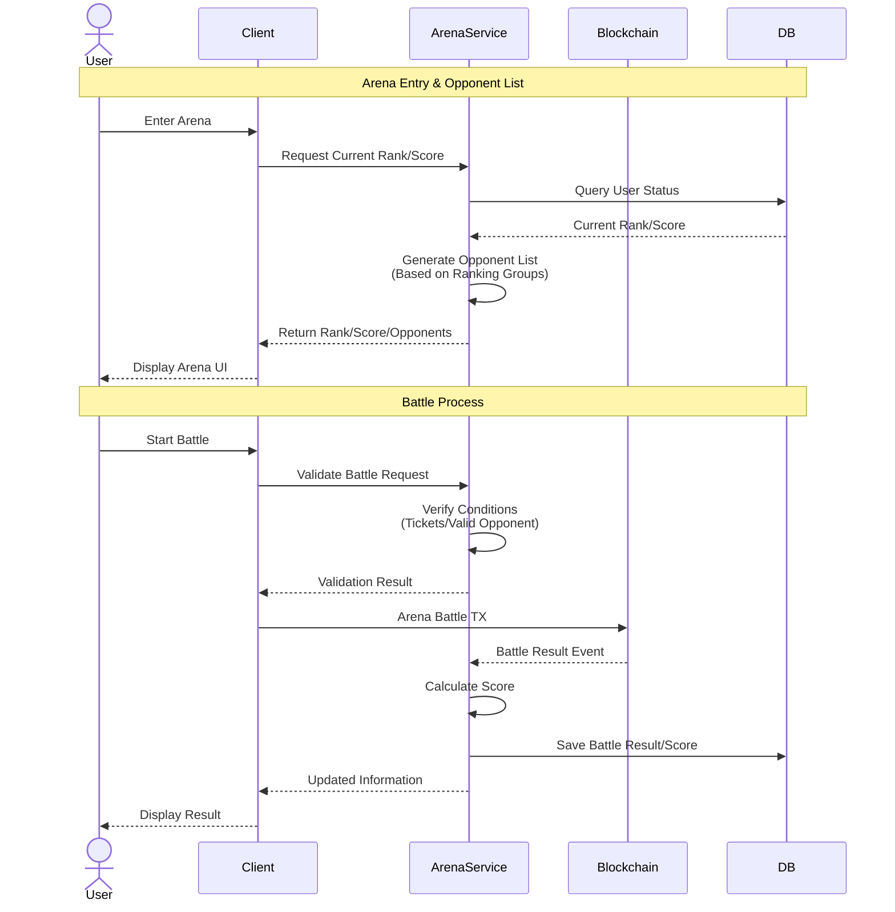

# Arena Service

Arena Service is a standalone service that manages the PvP system for Nine Chronicles. It separates score calculation and matching systems from the blockchain to provide a more flexible and scalable architecture.

## System Architecture

The service operates between the game client and the blockchain, managing all arena-related data and game logic while using the blockchain only for battle verification and recording.



## Getting Started

1. Install dependencies:
```bash
dotnet restore
```

2. Update database:
```bash
dotnet ef database update
```

3. Run the service:
```bash
dotnet run
```

## API Documentation

Detailed API documentation is available through Swagger at `/swagger` when running in development mode.

## License

This project is licensed under the MIT License - see the [LICENSE.md](LICENSE.md) file for details.
