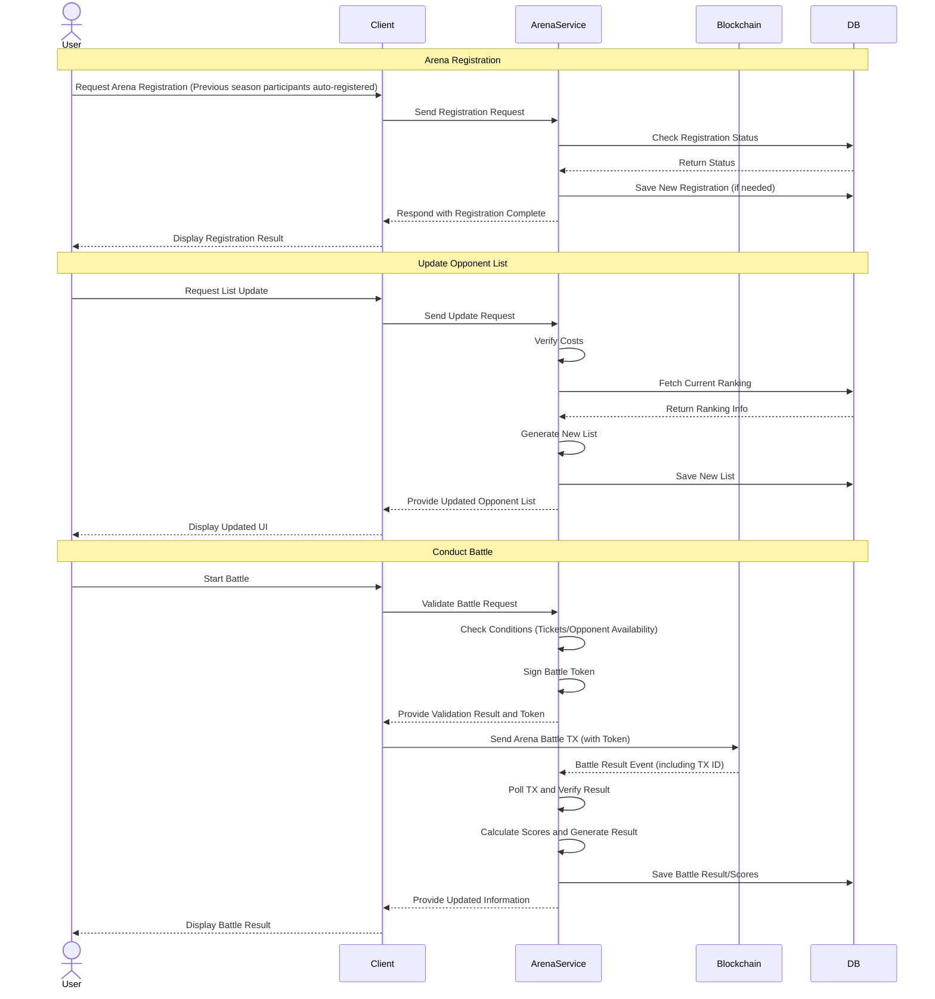

[][Discord]

[Discord]: https://planetarium.dev/discord

> [!TIP]
> If you're new to Nine Chronicles, check out our **Developer Portal**!
>
> https://nine-chronicles.dev/

# What is Arena Service?

Arena Service has evolved from its original design, as outlined in [NCIP-25](https://github.com/planetarium/NCIPs/pull/25/files). Instead of being managed directly on the Nine Chronicles blockchain via state, it now operates as an independent service.

While battle results must still be verified on-chain, all other aspects, such as ticketing and season management, are handled off-chain for improved flexibility and efficiency.

This service is designed to be **open and deployable** by anyone. If you're interested in running your own Arena Service, please refer to the [Operation Guide](https://github.com/planetarium/ArenaService/wiki/Operation).

# How It Works

Arena Service is structured as follows:

# API Access

Arena Service is deployed on the following domains:

https://{network}-arena.9c.gg/swagger/index.html
(e.g., https://odin-arena.9c.gg/swagger/index.html)

While it is recommended to interact with the service via a client, Swagger UI is available for convenience.

# Contribution

We welcome contributions to **Arena Service**! 🎉  
Check out the **[Contributor Guide](CONTRIBUTING.md)** for guidelines on how to get involved.

If you have **suggestions or feedback**, please visit our [Discussions](https://github.com/planetarium/ArenaService/discussions) section.

# License

Arena Service is licensed under **AGPL-3.0**. However, the **logo** and other branding elements are not covered under AGPL-3.0, as they are Planetarium's assets.
